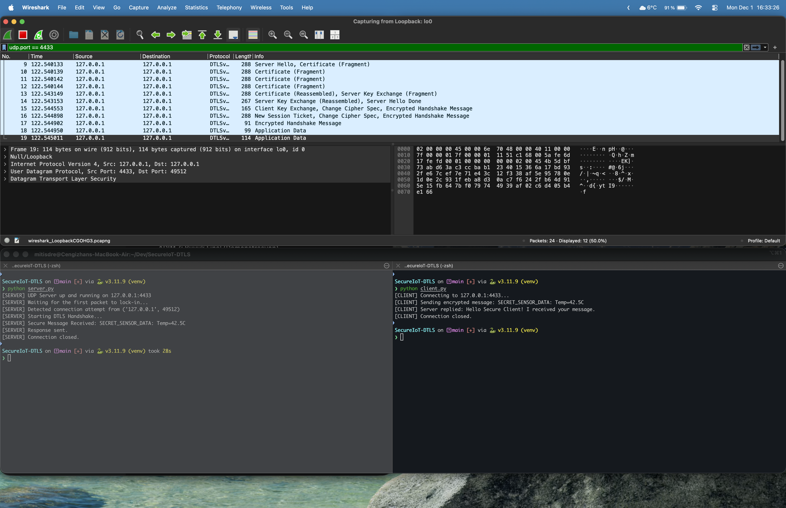
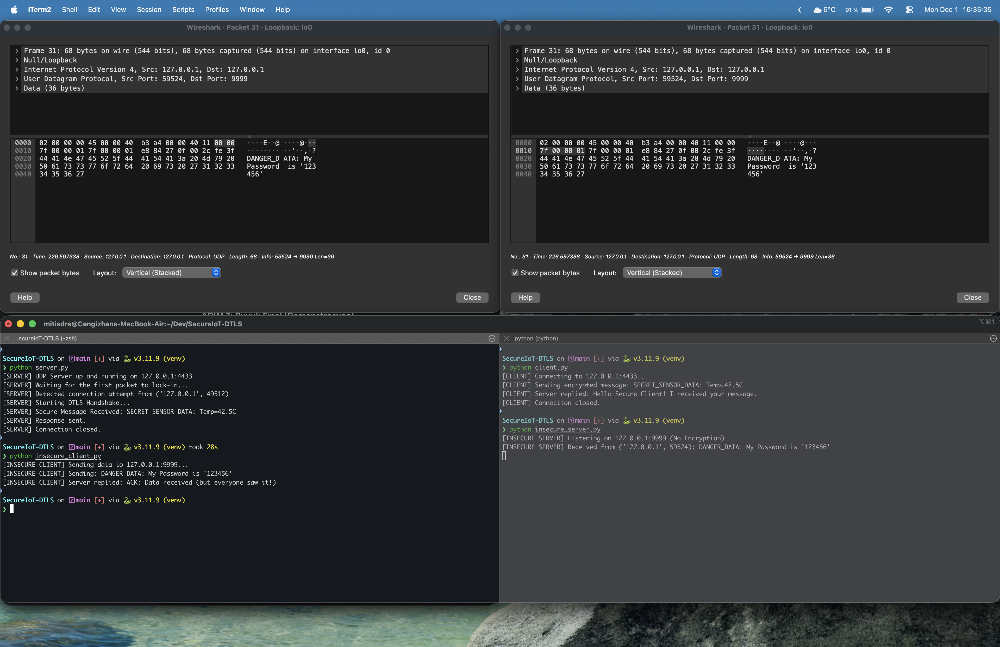

# Secure IoT Communication Protocol Simulation (DTLS)

This project demonstrates a secure communication channel designed for IoT (Internet of Things) devices using **DTLS (Datagram Transport Layer Security)**. It simulates a sensor-server architecture where sensitive data is transmitted over UDP.

The project includes a comparison between **Cleartext UDP** (Insecure) and **DTLS Encrypted UDP** (Secure) to showcase the importance of encryption and authentication in network security.

## 🚀 Features

* **Secure Communication:** Uses DTLS v1.2 via OpenSSL to encrypt UDP packets.
* **Full PKI Implementation:** Includes a shell script that establishes a **Root CA (Certificate Authority)** and signs Server/Client certificates to create a real Chain of Trust.
* **Server Authentication:** The client verifies the server's identity using the Root CA certificate to prevent Man-in-the-Middle (MitM) attacks.
* **Interactive Demo:** Clients support user input to verify encryption dynamically in real-time.
* **Packet Analysis:** Designed to be analyzed with Wireshark to verify encryption.
* **Insecure Baseline:** Includes a plain UDP implementation for side-by-side comparison.

## 🛠 Technology Stack

* **Language:** Python 3.x
* **Library:** `pyOpenSSL` (Wrapper for OpenSSL)
* **Protocol:** UDP / DTLS
* **Tools:** Wireshark (for traffic analysis), OpenSSL (for PKI management)

## 📦 Installation

1.  **Clone the repository:**
    ```bash
    git clone [https://github.com/Mitisdre/SecureIoT-DTLS.git](https://github.com/Mitisdre/SecureIoT-DTLS.git)
    cd SecureIoT-DTLS
    ```

2.  **Create a Virtual Environment:**
    ```bash
    python3 -m venv venv
    source venv/bin/activate  # On Windows: venv\Scripts\activate
    ```

3.  **Install Dependencies:**
    ```bash
    pip install -r requirements.txt
    ```

4.  **Generate Certificates (PKI Setup):**
    *Note: This script generates a Root CA and signs the server/client keys locally.*
    ```bash
    chmod +x gen_certs.sh
    ./gen_certs.sh
    ```

## 🚦 Usage

### 🔒 Secure Mode (DTLS)
1.  **Start the Server:**
    ```bash
    python server.py
    ```
2.  **Start the Client:**
    ```bash
    python client.py
    ```
3.  **Interact:**
    * The client will verify the server's certificate against the Root CA.
    * Enter a message (e.g., `Critical_Secret`) when prompted.
    * *Result: Wireshark shows "Application Data" (Encrypted).*

### 🔓 Insecure Mode (Plain UDP)
1.  **Start the Server:**
    ```bash
    python insecure_server.py
    ```
2.  **Start the Client:**
    ```bash
    python insecure_client.py
    ```
3.  **Interact:**
    * Enter a message (e.g., `MyPassword123`) when prompted.
    * *Result: Wireshark shows the actual message content in cleartext.*

## 🦈 How to Analyze with Wireshark

To reproduce the analysis screenshots, follow these steps:

1.  **Select Interface:** Open Wireshark and select the **Loopback** interface (usually named `lo0`, `lo`, or "Adapter for loopback traffic capture") since the traffic is local (127.0.0.1).
2.  **Apply Filter:** Paste the following filter into the Wireshark filter bar to isolate project traffic:
    ```text
    udp.port == 4433 || udp.port == 9999
    ```
3.  **Capture & Compare:**
    * **Insecure:** Run the insecure scripts and type a secret. Inspect the packet "Data" field to see the text clearly.
    * **Secure:** Run the secure scripts. You will see DTLS handshake packets followed by "Application Data". The payload is unreadable.

## 📸 Proof of Concept (Wireshark Analysis)

We analyzed the network traffic for both secure and insecure implementations to demonstrate the effectiveness of DTLS.

### 🔒 1. Secure Communication (DTLS)
*With DTLS enabled, the payload is fully encrypted. As seen below, Wireshark captures only meaningless bytes (Application Data). The attacker cannot read the sensor data.*



### 🔓 2. Insecure Communication (Plain UDP)
*Without encryption, the data is transmitted in cleartext. The sensitive information is clearly visible to anyone listening on the network.*



## 📄 License
This project is for educational purposes as part of the IT Security module.